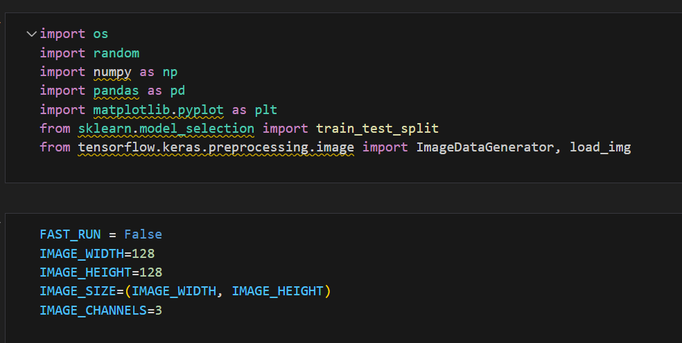

# Workshop for Cat/Dog Classification using CNN
Prerequisites for the workshop

-   Download the dataset from the
    [[dogs-vs-cats]](https://theproindia-my.sharepoint.com/:u:/p/karthikeyan/EXbRnIKivSVCm4yi_qAGPSABgZk0PgTOLNdzGRr831sSeA?e=QpwbZb)

-   Extract the same in the same folder

-   Open and  start working on the cnn-cat-dog-dl-ws.ipynb

## Notebook 

- Add the code from the given reference and run the cell.

- If the code already exists, please run the code and move to the next cell.

### Import all needed packages and declare constants

 

### Create dataframe with the files.

 

### Check the details of the data.

 

### Check the categories of the classification.

### Display the image.

### Add Convolution details to the model with other hidden layers

 

### Add callbacks for early stopping and learning rate optimization

 

### Create train and test data

 

### Check the validation data

 

### Create dataframe of images with twists and turn for train data.

 

### Create dataframe of images with twists and turn for validation data.

 

### Display all the twists and turned images

 

### Train the model using fit command

  

### Save the weights

 

### Display the accuracy graph

 

### Create dataframe of images with twists and turn for test data.

 

### Prepare the data to display the name in the visualisation

  

 

###  Print the result with prediction and image
 

### Save the prediction result in csv
 
